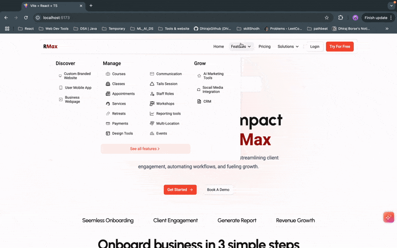

# Quest

A modern React application built with Vite, TypeScript, and React Router DOM.

---

## Hosted Link

[https://qest-nine.vercel.app/](https://qest-nine.vercel.app/)

---
## Demo Video Link
[Demo video link](https://drive.google.com/file/d/11ZJcLJUcab-OubIkNAHG5grQch4rLJHR/view?usp=sharing)


---

## How to Use

### 1. Landing Page (`/`)
   - https://qest-nine.vercel.app/
   - When you visit the application, you’ll start at the landing page.
   - Explore an overview of the platform and its features.

### 2. Pricing Page (`/pricing`)
   - https://qest-nine.vercel.app/pricing
   - Visit the pricing page to view subscription plans and options.
   - Choose the plan that suits your needs and proceed to purchase.

### 3. Support Page (`/support`)
   - https://qest-nine.vercel.app/support
   - Navigate to the support page for assistance.
   - Access FAQs, contact details, or submit a support ticket for help.

### 4. Feature Modal
   - https://qest-nine.vercel.app/
   - When you hover over or click on the **Feature** button in the header, the **Feature modal** will open.
   - The modal will display additional details or features of the platform.

---

## Visual Guide 


 

---

## Run the app locally with 4 simple steps:
## Prerequisites

Ensure you have the following installed on your system:

- **Node.js**: Version 20 or higher
- **npm**: Comes bundled with Node.js


## Installation

1. Clone the repository or download the source code:

   ```bash
   git clone https://github.com/DhirajsGithub/Qest
    ```
   ```bash
   cd Qest
   ```
2. Install the dependencies:
  
   ```bash
   npm install
   ```
3. Start the development server:

   ```bash
    npm run dev
    ```
4. Open the browser and navigate to `http://localhost:5173/` to view the application.


